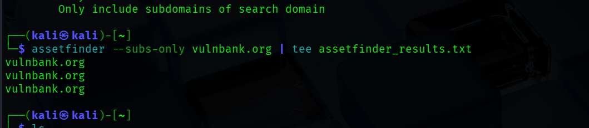
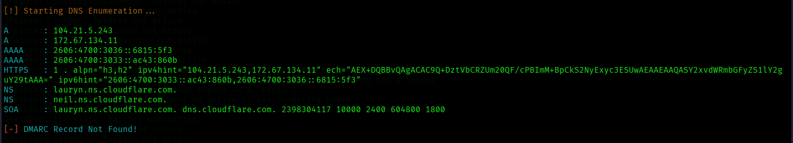
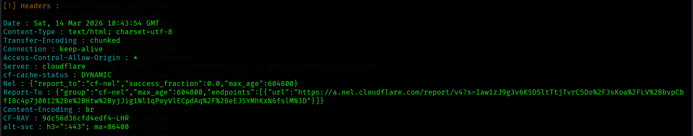
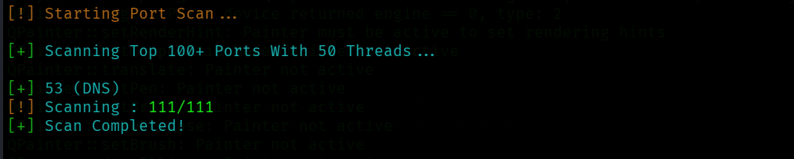
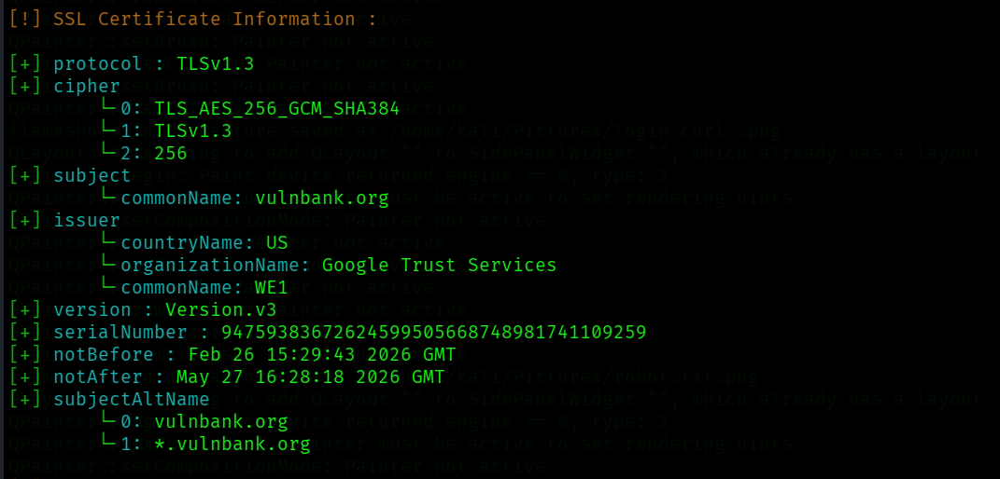

# Week 01 — Advanced Reconnaissance & Attack Surface Mapping

## Objective
Conduct thorough passive reconnaissance on a target domain
to identify its digital footprint without being detected.

## Target
- **Domain:** vulnbank.org
- **IP Address:** 172.67.134.11
- **CDN/Proxy:** Cloudflare (confirmed)
- **Registrar:** Cloudflare Inc.
- **Domain Age:** Created July 2025 (8 months old)

## Tools Used
| Tool | Purpose |
|------|---------|
| Whois | Domain registration & ownership info |
| Ping | Confirm target is alive, identify IP |
| Subfinder | Passive subdomain enumeration |
| Assetfinder | Subdomain discovery via passive sources |
| Amass | Deep attack surface mapping |
| CRT.sh | SSL certificate transparency logs |
| Dig | DNS record enumeration |

## Findings

### Whois Analysis
| Field | Value | Significance |
|-------|-------|-------------|
| Registrar | Cloudflare Inc | Domain behind Cloudflare proxy |
| Created | 2025-07-05 | Very new domain |
| Name Servers | lauryn.ns.cloudflare.com | Cloudflare DNS confirmed |

### Subdomain Enumeration Results
| Tool | Subdomains Found | Notes |
|------|-----------------|-------|
| Subfinder | 0 | Missing API keys, Cloudflare blocking |
| Assetfinder | 0 | New domain, minimal passive data |
| Amass | 0 | Passive mode, Cloudflare blocking |
| CRT.sh | 0 named subdomains | Wildcard cert found (see below) |

### CRT.sh Certificate Analysis
| Field | Value |
|-------|-------|
| Certificates Found | 19 |
| Coverage | *.vulnbank.org + vulnbank.org |
| Certificate Authorities | Let's Encrypt, Google Trust Services |
| First Issued | 2025-07-05 (matches domain creation) |
| Latest Certificate | 2026-03-06 (expires 2026-06-04) |

**Key Finding:** Wildcard certificate (*.vulnbank.org) is in use.
This confirms subdomains exist but individual names are not
exposed through certificate transparency logs. Certificate
management appears fully automated via Cloudflare.

### DNS Records
*(To be added — dig scans in progress)*

## Key Learnings
1. Cloudflare hides real origin IPs behind proxy ranges (172.64.0.0/13)
2. New domains have minimal historical data in passive databases
3. API keys significantly improve subfinder coverage
4. Wildcard certificates confirm subdomains exist without revealing names
5. No single tool is sufficient — cross referencing is essential
6. 0 results IS a valid finding — documents target security posture

## Challenges Encountered
- Subfinder returned 0 results due to missing API keys
- Cloudflare WAF actively blocking automated enumeration
- Wildcard certificate hides individual subdomain names

## Recommendations
- Proceed to DNS brute forcing with dnsx or gobuster
- Search Shodan for historical IP exposure before Cloudflare
- Add API keys to Subfinder for better passive coverage

## Screenshots

### Assetfinder Results


### CRT.sh Results


### DNS Records


### HTTP Headers


### Port Scan


### SSL Certificate


### Subdomain Enumeration


### Dig Results


https://github.com/Techmicky/CyberSecurity-Portfolio-
```
